# Streamdown Benchmark Suite

A performance benchmark comparing three approaches to rendering streaming markdown in React. Measures DOM element count, memory, and throughput in real time — with CSV export for offline analysis and Python scripts to generate charts and GIFs.

## Motivation

When streaming LLM output to the browser, the rendering strategy directly affects perceived performance and browser resource usage. This suite streams a ~438 KB markdown document and measures three different approaches to answer: **does virtualization matter, and how much overhead does block-splitting add?**

---

## Rendering Modes

| Mode | Strategy |
|---|---|
| **Standard** | Single `<Streamdown>` component receives the full accumulated text. No block splitting. Simplest approach. |
| **Block** | Text is split into blocks via `parseMarkdownIntoBlocks`. Each block has its own memoized `<Streamdown>`. No virtualization. |
| **Virtualized** | Same block splitting, but rendered through `@tanstack/react-virtual`. Only visible blocks are mounted in the DOM. |

---

## Running the App

**Requirements:** Node.js ≥ 18, [pnpm](https://pnpm.io)

```bash
pnpm install
pnpm dev
```

Open [http://localhost:5173/test-md-stream/](http://localhost:5173/test-md-stream/).

```bash
pnpm build     # production build
pnpm preview   # preview the build locally
```

---

## Running the Benchmark

### 1. Collect data in the browser

1. Open a rendering mode page (Standard, Block, or Virtualized)
2. Click **Start Stream** — the benchmark overlay activates automatically
3. After the stream completes, click **Export CSV** in the benchmark bar
4. Move the downloaded file to the `data/` folder at the project root:
   - `data/benchmark-standard.csv`
   - `data/benchmark-block.csv`
   - `data/benchmark-virtualized.csv`
5. Repeat for each of the three modes

> **Tips for a fair comparison:**
> - Use the same **Speed** setting across all three runs (e.g. 12 chars/tick)
> - Close other tabs and DevTools to reduce noise
> - Use **Chrome or Edge** — `performance.memory` is Chromium-only; Firefox/Safari will show `0` for memory

### 2. CSV format

Each row is one measurement taken after a React render commit during streaming:

```
step,time_ms,characters,dom_elements,memory_estimate_bytes
1,8,96,312,4521984
2,16,192,318,4554752
...
```

| Column | Description |
|---|---|
| `step` | Sequential measurement number |
| `time_ms` | Elapsed time since stream start (ms) |
| `characters` | Characters revealed so far |
| `dom_elements` | `document.querySelectorAll('*').length` at render time |
| `memory_estimate_bytes` | `performance.memory.usedJSHeapSize` (Chromium only, else `0`) |

---

## Generating Charts and GIFs

**Requirements:** Python ≥ 3.8

```bash
cd scripts
pip install -r requirements.txt
```

Then run any of the three scripts (from the `scripts/` directory):

```bash
# Static side-by-side comparison charts (PNG)
python compare_charts.py

# Animated GIFs — individual evolution per page type and metric
python gif_individual.py

# Animated GIFs — all page types side by side, synchronized by time
python gif_comparison.py
```

All output goes to `data/charts/` and `data/gifs/` (created automatically).

---

## Results

### Static comparison — all metrics

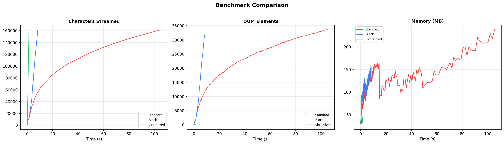

### Characters streamed

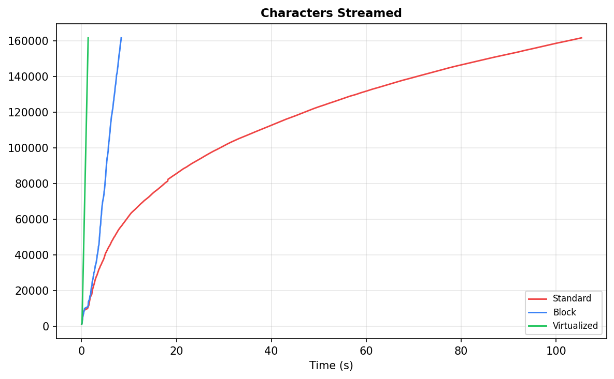

### DOM elements

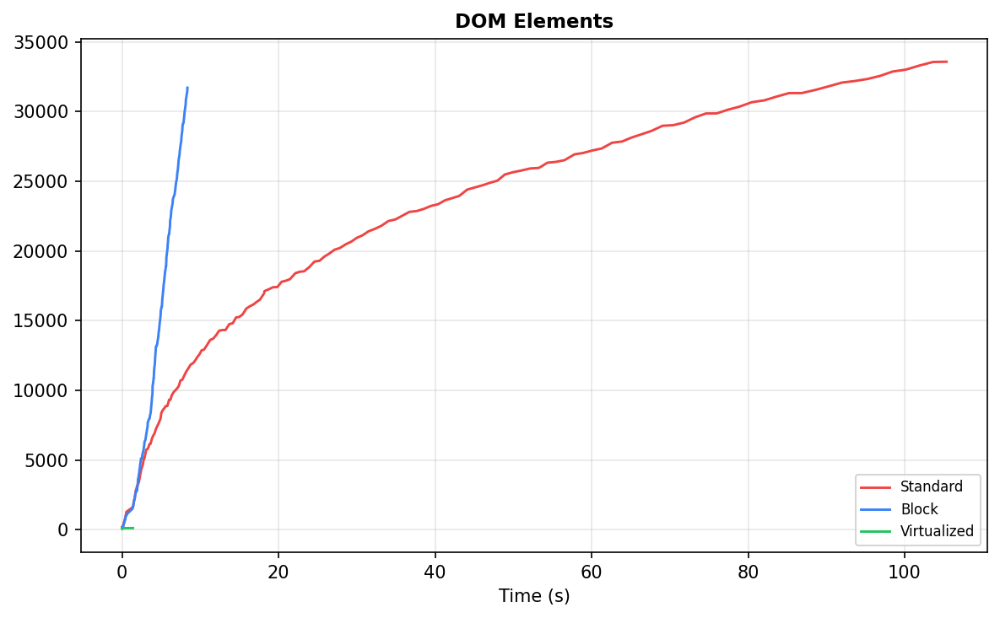

### Memory (JS heap)

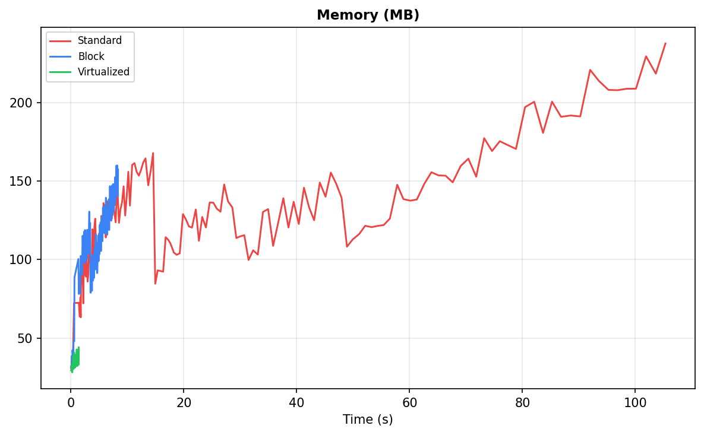

---

## Animated comparisons (side by side)

### Characters — all modes

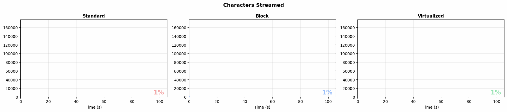

### DOM elements — all modes

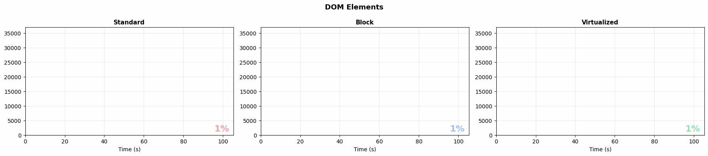

### Memory — all modes

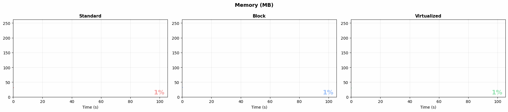

---

## Individual evolutions

### Standard

| Characters | DOM elements | Memory |
|:---:|:---:|:---:|
| 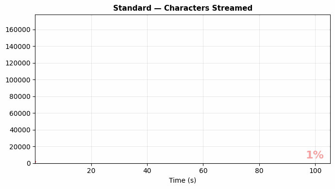 | 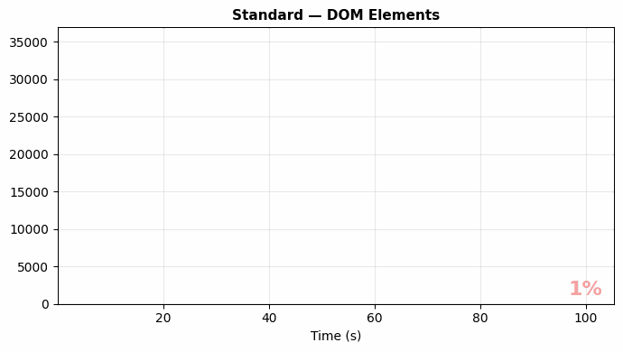 | 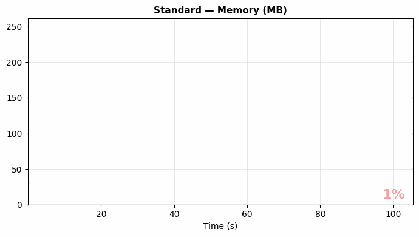 |

### Block

| Characters | DOM elements | Memory |
|:---:|:---:|:---:|
| 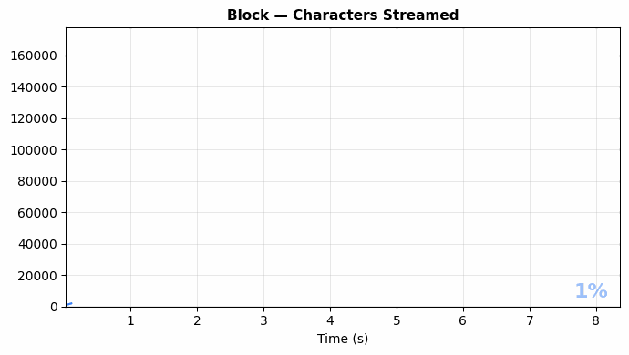 | 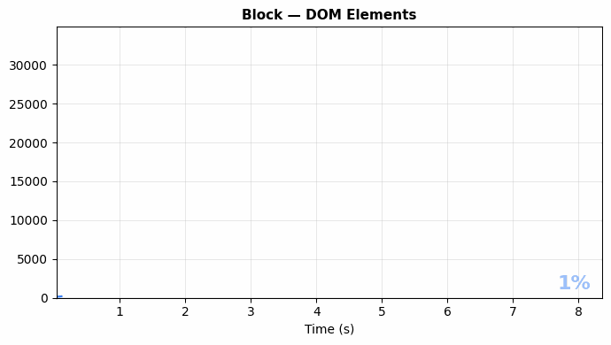 | 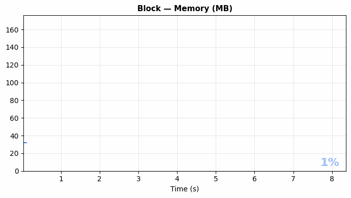 |

### Virtualized

| Characters | DOM elements | Memory |
|:---:|:---:|:---:|
| 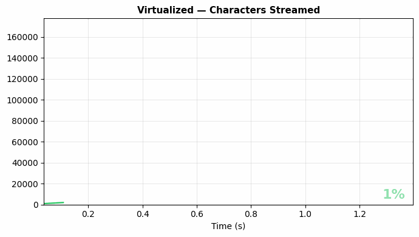 | 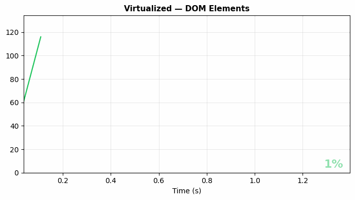 | 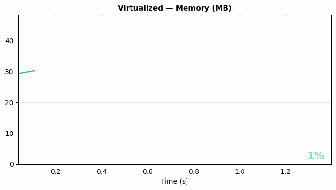 |

---

## How the Benchmark Works

The `useBenchmark` hook fires a `useEffect` after every DOM commit triggered by a stream tick (each tick is a separate `setInterval` macrotask, so React commits them individually). Each effect call captures:

| Metric | How it's collected |
|---|---|
| `time_ms` | `elapsedMs` from the stream engine state |
| `characters` | Characters revealed so far (passed as prop) |
| `dom_elements` | `document.querySelectorAll('*').length` after commit |
| `memory_estimate_bytes` | `performance.memory.usedJSHeapSize` if available |

Data is stored in a `ref` array — no extra renders on every tick. The overlay display throttles to every 10 steps so the benchmark UI itself doesn't inflate the DOM count.

---

## Project Structure

```
├── data/                           # Place benchmark CSVs here
│   ├── charts/                     # Generated PNGs (auto-created)
│   └── gifs/                       # Generated GIFs (auto-created)
├── scripts/
│   ├── compare_charts.py           # Static side-by-side comparison charts
│   ├── gif_individual.py           # Per-mode animated GIFs
│   ├── gif_comparison.py           # Side-by-side synchronized GIFs
│   └── requirements.txt            # matplotlib, pandas, Pillow
└── src/
    ├── hooks/
    │   ├── useBenchmark.ts         # Per-tick metric collection
    │   └── useSimpleStreamEngine.ts # Text-only engine (no block parsing)
    ├── components/
    │   ├── BenchmarkOverlay.tsx    # Live metrics bar + Export CSV button
    │   ├── BlockStream.tsx         # Non-virtualized block renderer
    │   ├── StatsBar.tsx            # Progress / chars / speed / elapsed
    │   └── StreamControls.tsx      # Start / Stop / Reset / Speed slider
    ├── pages/
    │   ├── HomePage.tsx            # Mode selection cards
    │   ├── StandardStreamPage.tsx
    │   ├── BlockStreamPage.tsx
    │   └── VirtualizedStreamPage.tsx
    ├── utils/
    │   └── csv.ts                  # CSV serialization + browser download
    ├── content.ts                  # ~438 KB markdown document
    ├── useStreamEngine.ts          # Block-splitting stream engine
    ├── VirtualizedStream.tsx       # @tanstack/react-virtual renderer
    └── router.tsx                  # react-router-dom route definitions
```

---

## Tech Stack

| | Library / Version |
|---|---|
| UI | React 19 + TypeScript 5.9 |
| Bundler | Vite 8 |
| Styling | Tailwind CSS 4 |
| Routing | react-router-dom 7 |
| Markdown streaming | [streamdown](https://github.com/luizbills/streamdown) 2.x |
| Virtualization | @tanstack/react-virtual 3 |
| Math rendering | KaTeX via @streamdown/math |
| Code highlighting | @streamdown/code |
| Charts / GIFs | matplotlib 3.8+ · pandas 2.1+ · Pillow 10+ |
| Package manager | pnpm 10 |
